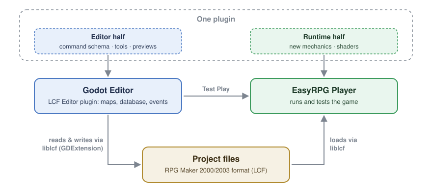
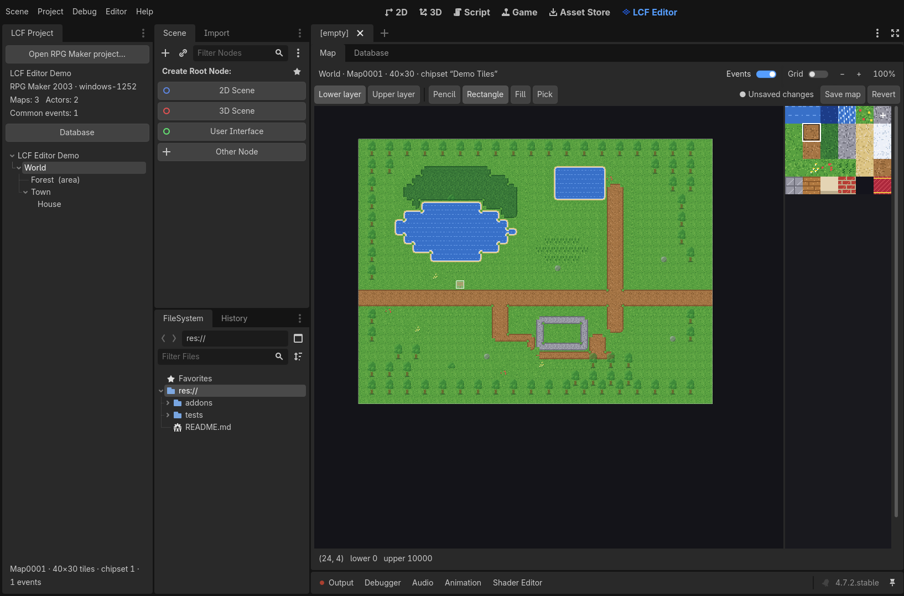

# godot-lcf-editor

[](https://github.com/depuschm/godot-lcf-editor/actions/workflows/build.yml)

Godot editor for RPG Maker 2000/2003 projects (LCF format), built on [liblcf](https://github.com/EasyRPG/liblcf). Extensible through plugins, playtested with [EasyRPG Player](https://github.com/EasyRPG/Player).

> **Status: early prototype.** The editor plugin opens an existing RPG Maker 2000/2003 project, renders its maps, and lets you browse and edit its whole database inside Godot. Map and event editing come next — see the [roadmap](#roadmap). Keep backups of your projects while trying it.

## Vision

RPG Maker 2000/2003 still has an active community, but its editor and runtime are closed, Windows-only programs. Existing patches (Maniacs, DynRPG, Destiny) add fixed feature sets; none lets users extend the **editor itself**.

This project aims to change that:

- **Godot as the editor.** Maps, database and events are edited in Godot, and projects stay in the original RPG Maker 2000/2003 format.
- **EasyRPG Player as the runtime.** Games are played and tested with the open-source reimplementation of the RPG Maker runtime.
- **Everything is a plugin.** A feature such as pixel-perfect movement or shader support ships as an *editor half* (dialogs, tools, previews) and a *runtime half* (the mechanic in the player). Event command dialogs are generated from data, so a plugin registers a new command and gets its dialog for free.

<p align="center">
  
</p>

The full vision, the existing landscape and the options considered are in [`docs/vision.tex`](docs/vision.tex).

## What works today



- Open an RPG Maker 2000 or 2003 project folder from the **LCF Project** dock.
- Detects engine version (2000/2003) and text encoding (from `RPG_RT.ini` or by analysing the database).
- Shows the map tree, including areas, and basic facts per map.
- Selecting a map opens it in the **LCF Editor** screen (next to 2D, 3D and Script), **Map** tab: lower and upper layer with the project's chipset, including ground autotiles, water with shores and deep-water edges, and event markers. Zoom with the mouse wheel, pan with the middle or right mouse button; the status line shows the tile IDs under the cursor.
- The **Database** tab shows every section of the database (actors, classes, skills, items, enemies, troops, states, vocabulary, system, common events, switches, variables, …). Every field of the selected entry is listed, nested structures can be expanded, event commands appear by name with their indentation, and references such as `class_id` or `switch_id` show the name they point to. Fields come straight from liblcf's own description of the format, so new fields (including Maniacs and EasyRPG extensions) appear automatically.
- **Editing the database:** double-click a field to change it (checkbox for yes/no, number box, text field). **Save** writes `RPG_RT.ldb`; **Revert** drops unsaved changes, and Godot warns about unsaved changes when it closes. Event commands are still read-only.
- **Safe saving:** before every save the current file is copied to a backup (the newest 20 are kept in Godot's user data folder, under `backups/`). The new database is written to a temporary file, read back and compared before it replaces the original. The save counter is increased like RPG Maker does.
- **Byte-exact round trips:** databases saved by RPG Maker 2000 and 2003 (and PowerMode2003) are written back byte for byte when nothing was changed, and every entry passes through the editor without changing a byte (tested with [EasyRPG's TestGame](https://github.com/EasyRPG/TestGame), 760–890 entries per game). Databases from the Maniacs Patch or EasyRPG can contain empty or unknown fields that liblcf leaves out; the editor detects this when a project opens, shows a warning, and asks before saving.
- Chipsets in PNG, BMP and RPG Maker's XYZ format, with palette colour 0 transparent as in RPG Maker.
- Exposes everything to GDScript through `LcfProject` and `LcfChipset`:

```gdscript
var project := LcfProject.new()
if project.load("C:/Games/MyRpg") == OK:
    var map := project.get_map(1)  # width, height, lower, upper, events, chipset_id
    var file := project.find_image("ChipSet", project.get_chipset(map.chipset_id).file)
    var chipset := LcfChipset.new()
    if chipset.load(file) == OK:
        var tile: Image = chipset.render_tile(map.lower[0])
    for entry in project.get_database_entries("actors"):  # also "skills", "items", ...
        print(entry.id, ": ", entry.name)
```


The autotile and water composition (`extension/src/tile_rules.h`) is our own implementation of the chipset format; it was checked against EasyRPG Player's reference tables for every ground autotile, water combination and animation frame.

**Not yet:** editing maps and event commands, adding or removing database entries, RTP graphics (chipsets must be inside the project), tile animation.

## Repository layout

```
project.godot              Open this folder in Godot 4.5+
addons/lcf_editor/         Editor plugin (GDScript) + the GDExtension's binaries
extension/                 C++ GDExtension wrapping liblcf (CMake)
thirdparty/liblcf/         git submodule – RPG Maker 2000/2003 file formats
thirdparty/godot-cpp/      git submodule – Godot C++ bindings
thirdparty/libexpat/       git submodule – XML parser liblcf uses to read edited entries
demo/                      Tiny generated test project with its own chipset (no RPG Maker assets)
tests/                     Headless smoke and round-trip tests, a map-to-PNG renderer
tools/                     Demo generators: chipset (Python), maps from text grids (C++)
docs/                      Vision document and README images
```

## Download

Every push is built and tested on **Windows** and **Linux** by [GitHub Actions](https://github.com/depuschm/godot-lcf-editor/actions/workflows/build.yml): the smoke test, the round-trip test on the demo and on EasyRPG's TestGame (2000, 2003, Maniacs), and a check that the Godot editor loads the plugin.

- **Releases:** ready-to-use addon zips with Windows and Linux binaries appear under [Releases](https://github.com/depuschm/godot-lcf-editor/releases) once a version is tagged.
- **Latest build:** open the newest successful run on the [Actions page](https://github.com/depuschm/godot-lcf-editor/actions/workflows/build.yml) and download `lcf_editor-Windows` or `lcf_editor-Linux` (needs a GitHub login).

To use a download, put the `lcf_editor` folder into your Godot project's `addons/` folder (or clone this repository and copy it into `addons/lcf_editor`), then enable **LCF Editor** under *Project → Project Settings → Plugins*. macOS builds are not provided yet.

## Building

**Requirements:** Godot 4.5 or newer, CMake 3.17+, a C++17 compiler, and ICU for text encodings
(Linux: `libicu-dev`; macOS: `brew install icu4c`; Windows 10 1903+ uses the ICU built into the system).

```bash
git clone --recursive https://github.com/depuschm/godot-lcf-editor
cd godot-lcf-editor
cmake -S extension -B build -DCMAKE_BUILD_TYPE=Release
cmake --build build --config Release
```

The first build takes a while because it compiles godot-cpp. The library lands in `addons/lcf_editor/bin/`. Then open the folder in Godot; the **LCF Project** dock appears on the left.

Already cloned without `--recursive`? Run `git submodule update --init --recursive`.

**Windows:** run the commands in a *Developer Command Prompt for VS 2022* (or any shell with CMake and MSVC available).
**macOS:** pass `-DICU_ROOT=$(brew --prefix icu4c)` to the first `cmake` command. macOS builds are untested so far.
**Without ICU:** add `-DLCF_WITH_ICU=OFF`; only Western (Windows-1252) projects will then show correct text.

### Smoke test

```bash
godot --headless --path . --script res://tests/test_load_demo.gd
```

It loads `demo/` through the extension and prints the map tree. CI runs it with Godot 4.5.1 on Windows and Linux; it was also tested with 4.7.2.

In a fresh checkout, run `godot --headless --path . --import` once first. That very first headless import can abort while Godot registers the extension (godot-cpp's own example does the same); simply run it again.

### Round-trip test

Checks byte-exact saving, the edit path for every entry, a real edit with backup and the save counter. It always works on a copy in Godot's user data folder, never on the project itself:

```bash
godot --headless --path . --script res://tests/test_roundtrip.gd -- /path/to/RPG/project
```

Without a path it uses `demo/`.

### Rendering a map to PNG

```bash
godot --headless --path . --script res://tests/render_map.gd -- res://demo 1 map.png
```

### Regenerating the demo project

The demo chipset is drawn by a script (needs Pillow), and the maps are painted from the text grids in `tools/demo_maps/` (legend at the top of `tools/make_demo_project.cpp`):

```bash
python3 tools/make_demo_chipset.py demo/ChipSet/Demo.png
cmake -S tools -B build-tools && cmake --build build-tools
./build-tools/make_demo_project demo tools/demo_maps
```

## Roadmap

| | Milestone |
|---|---|
| M0 | Evaluate EasyRPG Editor; contact the EasyRPG team about a plugin API |
| M1 | liblcf in Godot: load a project ✅ |
| M2 | Map view with correct chipsets and autotiles ✅ |
| M3a | Database browser ✅ |
| M3b | Database editing and safe saving (backups, byte-identical round trip) ✅ |
| M4 | Event editor with data-driven command dialogs |
| M5 | Plugin API for the editor |
| M6 | Test Play with EasyRPG Player; runtime extension mechanism |
| M7 | Showcase plugins: pixel-perfect movement, shader support |

## Contributing

Ideas, issues and pull requests are welcome. Please never commit RPG Maker RTP assets or other copyrighted material; test projects must use self-made or freely licensed assets.

## License

MIT — see [LICENSE](LICENSE). Third-party components: liblcf (MIT), godot-cpp (MIT), libexpat (MIT).

This project is not affiliated with Kadokawa, Gotcha Gotcha Games or the EasyRPG project. RPG Maker is a trademark of its respective owners.
