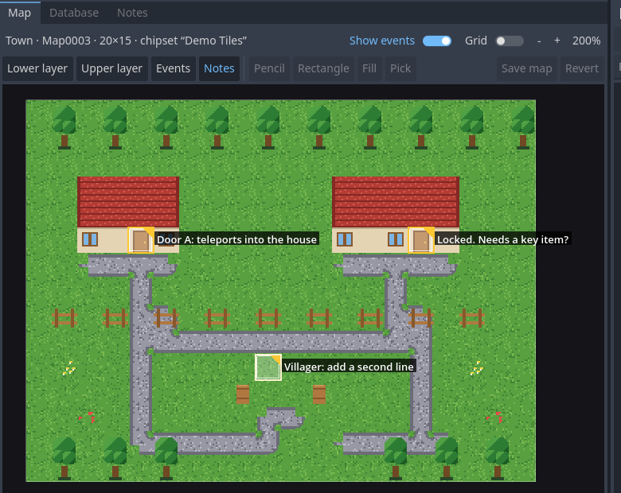

# godot-lcf-editor

[](https://github.com/depuschm/godot-lcf-editor/actions/workflows/build.yml)

Godot editor for RPG Maker 2000/2003 projects (LCF format), built on [liblcf](https://github.com/EasyRPG/liblcf). Extensible through plugins, playtested with [EasyRPG Player](https://github.com/EasyRPG/Player).

> **Status: early prototype.** The editor plugin opens an existing RPG Maker 2000/2003 project, lets you paint its maps, edit its events and their commands, and browse and edit its whole database inside Godot. **Test Play** runs it in EasyRPG Player, and other Godot plugins can extend both the editor and, through comment commands, the game ([writing plugins](#writing-plugins)). Showcase plugins come next — see the [roadmap](#roadmap). Keep backups of your projects while trying it.

## Vision

RPG Maker 2000/2003 still has an active community, but its editor and runtime are closed, Windows-only programs. Existing patches (Maniacs, DynRPG, Destiny) add fixed feature sets; none lets users extend the **editor itself**.

This project aims to change that:

- **Godot as the editor.** Maps, database and events are edited in Godot, and projects stay in the original RPG Maker 2000/2003 format.
- **EasyRPG Player as the runtime.** Games are played and tested with the open-source reimplementation of the RPG Maker runtime.
- **Everything is a plugin.** A feature such as pixel-perfect movement or shader support ships as an *editor half* (dialogs, tools, previews) and a *runtime half* (the mechanic in the player). Event command dialogs are generated from data, so a plugin registers a new command and gets its dialog for free.

<p align="center">
  
</p>

The full vision, the existing landscape and the options considered are in [`docs/vision.tex`](docs/vision.tex).

## What works today


- Open an RPG Maker 2000 or 2003 project folder from the **LCF Project** dock.
- Detects engine version (2000/2003) and text encoding (from `RPG_RT.ini` or by analysing the database).
- Shows the map tree, including areas, and basic facts per map.
- Selecting a map opens it in the **LCF Editor** screen (next to 2D, 3D and Script), **Map** tab: lower and upper layer with the project's chipset, including ground autotiles, water with shores and deep-water edges, and event markers. Zoom with the mouse wheel, pan with the middle mouse button (or Space + drag); the status line shows the tile IDs under the cursor.
- **Painting maps:** pick a tile in the palette (right of the map) and paint with **Pencil**, **Rectangle** or **Fill** on the lower or upper layer; right-click or **Pick** takes the tile under the cursor. Autotiles and water connect automatically: the painted tiles and their neighbours get the variants RPG Maker would choose, including shores and deep-water edges. Hold **Shift** to place the exact tile without autotiling. Every stroke can be undone with Godot's undo (Ctrl+Z).
- **Events:** the **Events** layer button switches the map to event editing. Click an event to select it, drag it to move it, double-click it to open the **event editor**, or double-click an empty cell to create one (named and numbered like RPG Maker does). Right-click for New, Edit, Copy, Paste and Delete; Delete, Ctrl+C and Ctrl+V work too.
- **Event editor:** name, pages as tabs (New page, Copy page, Delete page), every page setting (conditions, graphic, movement, trigger, layer, …) with readable choices such as “Action Button” or “Stay Still”, and the page's command list as RPG Maker shows it (“◆Control Switches: [0003: Chest opened] ON”). Every change can be undone with Ctrl+Z in the map.
- **Event commands:** **Insert…** opens a searchable list of commands by group; the common ones (Show Message, Control Switches and Variables, Conditional Branch, Teleport, Change Money/Items/Party/HP, Call Event, Wait, sounds, labels, loops, …) have dialogs with named choices (switches, items, maps and events by name). These dialogs are generated from a short description of each command, the same way plugins add their own ([below](#event-commands)). Editing follows the list's structure like RPG Maker: a branch comes with its bodies and Else, a message's lines stay together, Delete, Copy, Cut and Paste (also from the right-click menu) work on whole blocks. Every other command can be inserted and edited as raw data (code, indent, text, parameters), so nothing is out of reach.
- **Test Play:** **▶ Test Play** (in the LCF Project dock or the Test Play panel at the bottom) saves the project and runs it in [EasyRPG Player](https://easyrpg.org/player/) in test mode (F9 opens the debug menu). On the Events layer, right-click → **Play from here** starts a new game on that cell. The Player's output appears live in the **Test Play** panel; **Stop** ends the game. Under **Settings…** you choose the Player program, whether to skip the title screen, extra Player options, and whether the game enables EasyRPG extensions (see [comment commands](#runtime-half-comment-commands)).
- **Saving maps** works like the database: **Save map** makes a backup, writes a temporary file, reads it back and compares it before replacing `Map####.lmu`; **Revert** drops unsaved changes, and Godot asks about unsaved maps when it closes.
- The **Database** tab shows every section of the database (actors, classes, skills, items, enemies, troops, states, vocabulary, system, common events, switches, variables, …). Every field of the selected entry is listed, nested structures can be expanded, event commands appear by name with their indentation, and references such as `class_id` or `switch_id` show the name they point to. Fields come straight from liblcf's own description of the format, so new fields (including Maniacs and EasyRPG extensions) appear automatically.
- **Editing the database:** double-click a field to change it (checkbox for yes/no, number box, text field, list of named choices). **Save** writes `RPG_RT.ldb`; **Revert** drops unsaved changes, and Godot warns about unsaved changes when it closes. **Common events** get the same command list as map events.
- **Safe saving:** before every save the current file is copied to a backup (the newest 20 are kept in Godot's user data folder, under `backups/`). The new database is written to a temporary file, read back and compared before it replaces the original. The save counter is increased like RPG Maker does.
- **Byte-exact round trips:** databases saved by RPG Maker 2000 and 2003 (and PowerMode2003) are written back byte for byte when nothing was changed, and every entry passes through the editor without changing a byte (tested with [EasyRPG's TestGame](https://github.com/EasyRPG/TestGame), 760–890 entries per game). Databases from the Maniacs Patch or EasyRPG can contain empty or unknown fields that liblcf leaves out; the editor detects this when a project opens, shows a warning, and asks before saving.
- Chipsets in PNG, BMP and RPG Maker's XYZ format, with palette colour 0 transparent as in RPG Maker.
- Exposes everything to GDScript through `LcfProject` and `LcfChipset`:

```gdscript
var project := LcfProject.new()
if project.load("C:/Games/MyRpg") == OK:
    var map := project.get_map(1)  # width, height, lower, upper, events, chipset_id
    var file := project.find_image("ChipSet", project.get_chipset(map.chipset_id).file)
    var chipset := LcfChipset.new()
    if chipset.load(file) == OK:
        var tile: Image = chipset.render_tile(map.lower[0])
    for entry in project.get_database_entries("actors"):  # also "skills", "items", ...
        print(entry.id, ": ", entry.name)
    for event in map.events:  # id, name, x, y, page_count
        for command in project.get_map_event_commands(1, event.id, 0):  # code, indent, string, parameters
            print(LcfProject.get_event_command_name(command.code), " ", command.string)
```


The autotile and water rules (`extension/src/tile_rules.h`) are our own implementation of the chipset format. Drawing was checked against EasyRPG Player's reference tables for every ground autotile, water combination and animation frame. Painting was checked against maps saved by the real RPG Maker editor (EasyRPG's TestGame): recomputing every autotile reproduces the stored variants on all regularly painted maps; the differences are in test rooms where variants were placed by hand on purpose. Painting only recomputes the painted tiles and their neighbours, so hand-placed variants elsewhere stay as they are.

Untouched maps also save back byte for byte: all maps of TestGame-2003, -Maniacs and -EasyRPG and 77 of 78 maps of TestGame-2000 (the remaining one, and any other map where that is not the case, makes the editor ask before saving). Events go through the same exact path: every event of every TestGame (3,355 events with 54,139 commands in TestGame-2000 alone) and every common event passes through the editor without changing a byte.

**Not yet:** dialogs for the less common event commands (Show Choices, pictures, move routes and others are edited as raw data), event graphics on the map, adding or removing database entries, map properties (size, chipset), RTP graphics (chipsets must be inside the project), tile animation.

## Writing plugins

The LCF Editor is extended by ordinary Godot editor plugins. A plugin can add **map tools** (with their own button, mouse input and drawing on the map), **panels in the event editor** (per-event settings, next to the command list), **tabs** next to Map and Database, **event commands** with generated dialogs, a **material for the map** (to preview a shader), and keep its own **data with the project**. It learns about the open project and maps through signals, and uses Godot's undo/redo like any editor plugin.



The example plugin [`addons/lcf_map_notes`](addons/lcf_map_notes) (shown above) uses nearly every part of the API (all but the map material) and is meant to be copied: it pins notes to map cells and events (a “Notes” panel in the event editor), lists them in a tab, stores them in the project and adds a dialog for the *Shake Screen* command. It is enabled in this repository's `project.godot` and included in the release zip.

**Getting the API.** While the LCF Editor is enabled, `LcfEditorAPI.get_api()` returns it. Plugins may be enabled before or after the LCF Editor, so use both entry points:

```gdscript
@tool
extends EditorPlugin

var tool := MyTool.new()  # extends LcfMapTool

func _enter_tree() -> void:
    var api := LcfEditorAPI.get_api()
    if api:
        _lcf_editor_ready(api)

func _exit_tree() -> void:
    var api := LcfEditorAPI.get_api()
    if api:
        _lcf_editor_closing(api)

# Also called by the LCF Editor when it starts after this plugin.
func _lcf_editor_ready(api: LcfEditorAPI) -> void:
    api.add_map_tool(tool)
    api.map_shown.connect(_on_map_shown)

# Called by the LCF Editor before it goes away.
func _lcf_editor_closing(api: LcfEditorAPI) -> void:
    api.remove_map_tool(tool)
    api.map_shown.disconnect(_on_map_shown)
```

**What the API offers** ([`editor_api.gd`](addons/lcf_editor/editor_api.gd), [`map_tool.gd`](addons/lcf_editor/map_tool.gd)):

| | |
|---|---|
| Project and maps | `get_project()` (the `LcfProject`), `get_map_id()`, `get_map()`, `open_map(id)`, `get_selected_event()`, `edit_event(id)` |
| Signals | `project_opened`, `map_shown`, `map_changed` (tiles or events, also on undo), `map_saved`, `event_selected`, `database_modified_changed` |
| Map tools | `add_map_tool(tool)` with a subclass of `LcfMapTool`: override `_map_input(event, cell)`, `_draw_map(canvas, active)`, `_activated()`, `_deactivated()`; helpers `redraw()`, `is_on_map(cell)`, `cell_rect(cell)`, `get_zoom()` |
| Event editor panels | `add_event_panel(title, factory)`, `remove_event_panel(title)`: the factory gets `{ project, map_id, event_id, page, editor }` for each page shown and returns a Control |
| Tabs | `add_tab(control, title)`, `show_tab(control)`, `remove_tab(control)` |
| Map preview | `set_map_material(material)`: a material (e.g. a shader) on the map's tile layers; `redraw_map()` |
| Plugin data | `get_plugin_data(id, default)`, `set_plugin_data(id, data)`: JSON in `lcf-plugins/<id>.json` inside the RPG Maker project, so it travels with the game for the runtime half of a plugin (RPG Maker and EasyRPG Player ignore the folder) |
| Event commands | `LcfCommands.register(schema)`, see below; commands for the game as comments, see [runtime half](#runtime-half-comment-commands) |
| Test Play | `start_test_play(map_id, x, y)`: saves and runs the game (from a cell with a map ID) |

### Event commands

Event command dialogs are generated from data. A plugin can give any command code a dialog, or replace a built-in one, by registering a schema with `LcfCommands` (see [`command_registry.gd`](addons/lcf_editor/command_registry.gd) for every key):

```gdscript
@tool
extends EditorPlugin

func _enter_tree() -> void:
    LcfCommands.register({
        "code": 11050, "name": "Shake Screen", "group": "Screen",
        "params": [
            { "index": 0, "label": "Strength", "type": "int", "min": 1, "max": 9, "default": 3 },
            { "index": 1, "label": "Speed", "type": "int", "min": 1, "max": 9, "default": 3 },
            { "index": 2, "label": "Duration (tenths of a second)", "type": "int", "default": 10 },
            { "index": 3, "label": "Wait until done", "type": "bool" },
        ],
    })

func _exit_tree() -> void:
    LcfCommands.unregister(11050)
```

The command then appears under **Insert…**, gets its dialog and a readable line in the list. Use method callables (not lambdas) for a schema's `summary` and `sync`: the registry outlives scripts, and Godot cannot free a lambda after its script is gone. Parameter types include numbers, yes/no, choices, database references (`switch`, `variable`, `item`, `actor`, …), `map` and `event`; fields can depend on others (`"when": { 0: 1 }`), and a command can open a block (`"block": { "end": … }`). The built-in commands are described the same way, in [`builtin_commands.gd`](addons/lcf_editor/builtin_commands.gd).

### Runtime half: comment commands

A plugin's new game mechanics run in EasyRPG Player. Until the Player has an official plugin interface (the plan in [`docs/vision.tex`](docs/vision.tex) is to work that out with the EasyRPG team rather than fork the Player), new commands are stored the way RPG Maker patches have done for years: as **event comments in DynRPG syntax**, `@name arg, "text", …`. RPG Maker, the original runtime and every other tool keep them as ordinary comments, and EasyRPG Player executes them: commands starting with `easyrpg_` when the game enables EasyRPG extensions (`[Patch] EasyRPG=1` in its `EasyRPG.ini`, a checkbox in the Test Play settings), and any command in DynRPG mode, where a runtime plugin handles it.

In the editor, such a command is a schema with `comment` instead of `code`; it gets a dialog, a line in the list and a place under **Insert…** like any other command, and is stored as the comment:

```gdscript
LcfCommands.register({
    "comment": "pixel_move", "name": "Move by Pixels", "group": "Map",
    "runtime": "EasyRPG Player with the pixel movement plugin",
    "params": [
        { "index": 0, "label": "Event", "type": "event", "default": 10005 },
        { "index": 1, "label": "Right", "type": "int" },
        { "index": 2, "label": "Down", "type": "int" },
    ],
})
# Inserting it with the dialog stores the event comment  @pixel_move 10005, 4, -2
```

Arguments are numbers or (with `"type": "string"`) quoted strings, read the way EasyRPG Player reads them. The editor already offers EasyRPG Player's own comment commands this way: **Log Message** (`@easyrpg_output`, shown in the Player's log and on screen; the screenshot above comes from one) and **Add Numbers** (`@easyrpg_add`). Settings that are not commands, such as per-event hitboxes, go into the plugin's data file (`lcf-plugins/<id>.json`), which the runtime half reads from the game folder.

## Repository layout

```
project.godot              Open this folder in Godot 4.5+
addons/lcf_editor/         Editor plugin (GDScript) + the GDExtension's binaries
addons/lcf_map_notes/      Example plugin for the plugin API (map tool, event panel, tab, data, command)
extension/                 C++ GDExtension wrapping liblcf (CMake)
thirdparty/liblcf/         git submodule – RPG Maker 2000/2003 file formats
thirdparty/godot-cpp/      git submodule – Godot C++ bindings
thirdparty/libexpat/       git submodule – XML parser liblcf uses to read edited entries
demo/                      Tiny generated test project with its own chipset (no RPG Maker assets)
tests/                     Headless smoke and round-trip tests, a map-to-PNG renderer
tools/                     Demo generators: chipset (Python), maps from text grids (C++)
docs/                      Vision document and README images
```

## Download

Every push is built and tested on **Windows** and **Linux** by [GitHub Actions](https://github.com/depuschm/godot-lcf-editor/actions/workflows/build.yml): the smoke test, the round-trip test on the demo and on EasyRPG's TestGame (2000, 2003, Maniacs), the event command, plugin API, Test Play and event editor tests, and a check that the Godot editor loads both plugins without script errors.

- **Releases:** ready-to-use addon zips with Windows and Linux binaries appear under [Releases](https://github.com/depuschm/godot-lcf-editor/releases) once a version is tagged.
- **Latest build:** open the newest successful run on the [Actions page](https://github.com/depuschm/godot-lcf-editor/actions/workflows/build.yml) and download `lcf_editor-Windows` or `lcf_editor-Linux` (needs a GitHub login).

To use a download, put the `lcf_editor` folder into your Godot project's `addons/` folder (or clone this repository and copy it into `addons/lcf_editor`), then enable **LCF Editor** under *Project → Project Settings → Plugins*. The zip also contains the example plugin `lcf_map_notes`; copy it too if you want it. macOS builds are not provided yet.

## Building

**Requirements:** Godot 4.5 or newer, CMake 3.17+, a C++17 compiler, and ICU for text encodings
(Linux: `libicu-dev`; macOS: `brew install icu4c`; Windows 10 1903+ uses the ICU built into the system).

```bash
git clone --recursive https://github.com/depuschm/godot-lcf-editor
cd godot-lcf-editor
cmake -S extension -B build -DCMAKE_BUILD_TYPE=Release
cmake --build build --config Release
```

The first build takes a while because it compiles godot-cpp. The library lands in `addons/lcf_editor/bin/`. Then open the folder in Godot; the **LCF Project** dock appears on the left.

Already cloned without `--recursive`? Run `git submodule update --init --recursive`.

**Windows:** run the commands in a *Developer Command Prompt for VS 2022* (or any shell with CMake and MSVC available).
**macOS:** pass `-DICU_ROOT=$(brew --prefix icu4c)` to the first `cmake` command. macOS builds are untested so far.
**Without ICU:** add `-DLCF_WITH_ICU=OFF`; only Western (Windows-1252) projects will then show correct text.

### Smoke test

```bash
godot --headless --path . --script res://tests/test_load_demo.gd
```

It loads `demo/` through the extension and prints the map tree. CI runs it with Godot 4.5.1 on Windows and Linux; it was also tested with 4.7.2.

In a fresh checkout, run `godot --headless --path . --import` once first. That very first headless import can abort while Godot registers the extension (godot-cpp's own example does the same); simply run it again.

### Round-trip test

Checks byte-exact saving of the database and every map, the edit path for every database entry, event and command list, a real edit with backup and the save counter, painting a small lake (shores, undo, map saving), and creating, editing, deleting and restoring an event. It always works on a copy in Godot's user data folder, never on the project itself:

```bash
godot --headless --path . --script res://tests/test_roundtrip.gd -- /path/to/RPG/project
```

Without a path it uses `demo/`.

### Event command tests

Checks the command descriptions (schemas), registering a plugin command, and the block rules (inserting, deleting, copying, Else). With a project, every command of every event is described and its structure checked (77,000 lines across EasyRPG's TestGames):

```bash
godot --headless --path . --script res://tests/test_commands.gd -- /path/to/RPG/project
```

### Plugin API test

Drives `LcfEditorAPI` with the real map and database views and the example plugin's notes: signals, tabs, plugin data in the project, a map tool's button, input and drawing, event editor panels and the map material.

```bash
godot --headless --path . --script res://tests/test_plugin_api.gd
```

### Test Play test

Checks the Player's command line, the EasyRPG.ini setting, and starting, logging and stopping a process (on Linux and macOS a shell script stands in for the Player). With the path of a real EasyRPG Player it runs end to end: a copy of the demo gets an autorun event with the Log Message comment command, and its message must arrive in the Test Play log (needs a display, e.g. `xvfb-run`):

```bash
godot --headless --path . --script res://tests/test_test_play.gd -- /path/to/easyrpg-player
```

### Event editor test

Drives the real map view, event editor and database view without a window, on a copy of `demo/`: creating, renaming, moving, copying and deleting events, page settings, pages, the command picker and generated dialogs, branches with and without Else, copy and paste of blocks, the undo states, and common event commands.

```bash
godot --headless --path . --script res://tests/test_event_editor.gd
```

### Rendering a map to PNG

```bash
godot --headless --path . --script res://tests/render_map.gd -- res://demo 1 map.png
```

### Regenerating the demo project

The demo chipset is drawn by a script (needs Pillow), and the maps are painted from the text grids in `tools/demo_maps/` (legend at the top of `tools/make_demo_project.cpp`):

```bash
python3 tools/make_demo_chipset.py demo/ChipSet/Demo.png
cmake -S tools -B build-tools && cmake --build build-tools
./build-tools/make_demo_project demo tools/demo_maps
```

## Roadmap

| | Milestone |
|---|---|
| M0 | Evaluate EasyRPG Editor; contact the EasyRPG team about a plugin API |
| M1 | liblcf in Godot: load a project ✅ |
| M2 | Map view with correct chipsets and autotiles ✅ |
| M2b | Map painting with autotiles, undo and safe saving ✅ |
| M3a | Database browser ✅ |
| M3b | Database editing and safe saving (backups, byte-identical round trip) ✅ |
| M4a | Event editor: events on the map, pages, page settings, command lists (raw editing), undo ✅ |
| M4b | Data-driven dialogs for event commands, registered by plugins; block-aware editing ✅ |
| M5 | Plugin API for the editor: map tools, event editor panels, tabs, map material, plugin data, signals; example plugin ✅ |
| M6 | Test Play with EasyRPG Player; runtime extension mechanism (comment commands, plugin data) ✅ |
| M7 | Showcase plugins: pixel-perfect movement, shader support |

## Contributing

Ideas, issues and pull requests are welcome. Please never commit RPG Maker RTP assets or other copyrighted material; test projects must use self-made or freely licensed assets.

## License

MIT — see [LICENSE](LICENSE). Third-party components: liblcf (MIT), godot-cpp (MIT), libexpat (MIT).

This project is not affiliated with Kadokawa, Gotcha Gotcha Games or the EasyRPG project. RPG Maker is a trademark of its respective owners.
